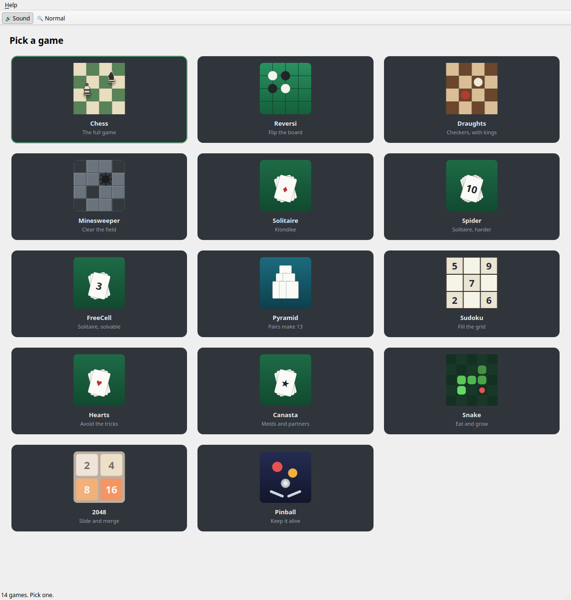

# Games

A small collection of desktop games for Linux, in one window sized to sit
beside whatever you are actually working on.



## The games

| Game | What it is |
|------|------------|
| **Chess** | The full game against the computer — castling, en passant, promotion and every draw rule, at three strengths. |
| **Reversi** | The classic disc-flipping board game, against the computer, with three difficulty levels. |
| **Draughts** | Checkers against the computer — compulsory captures, multi-jumps and kings. |
| **Minesweeper** | Beginner, Intermediate and Expert fields. |
| **Solitaire** | Klondike, draw one or draw three. |
| **Spider** | Spider solitaire in one, two or four suits. |
| **FreeCell** | Four free cells, everything face up, almost always solvable. |
| **Pyramid** | Clear the pyramid by taking pairs that add to 13. |
| **Sudoku** | Generated puzzles at three difficulties, with pencil marks. |
| **Hearts** | Four-handed Hearts against three computer players, to 100. |
| **Canasta** | Partnership Canasta, two against two, with melds, wild cards, red threes and a freezing discard pile. Classic rules, plus a house set you can edit. |
| **Snake** | Eat, grow, and don't run into anything. |
| **2048** | Slide the tiles, merge the numbers. |
| **Pinball** | One table, three balls, two flippers. |

Pick a game from the grid; **← All Games** (or `Esc`) goes back. Each game puts
its own buttons — New Game, Undo, difficulty — on the toolbar beside it, and
the **Sound** switch at the right mutes the lot.

Best scores are kept between sessions: games won at Chess and Draughts, discs
won at each Reversi level, fastest Minesweeper and Sudoku clears, top Klondike
score, fewest Spider and FreeCell moves, lowest winning Hearts total, highest
winning Canasta score, and the Snake, 2048 and Pinball high scores.

## Playing

**Chess.** You are White and move first. Click a piece to select it — the
squares it can reach show a dot, and the ones it can capture show a ring.
Click one to move. A pawn reaching the far rank asks which piece it should
become. A king in check is lit in red, and the rule that a move must get you
out of check is enforced, so a piece that cannot help simply offers no moves.
Undo takes back your move and the computer's reply together. Draws by
stalemate, the fifty-move rule, threefold repetition and insufficient material
are all detected and named when the game ends.

**Reversi.** You are Black and move first. Click a square with a faint dot on
it. Your move must trap a line of the computer's discs between the square you
click and one of your own, and every disc trapped flips to your colour. If you
have no legal move your turn is skipped automatically — that is the rule, not a
bug. Undo rewinds your move *and* the computer's reply.

**Minesweeper.** Left click digs, right click plants a flag. A number says how
many mines touch that square. Clicking a number you have fully flagged clears
its remaining neighbours in one go. The first click is always safe.

**Solitaire (Klondike).** Drag cards to build the four foundations up from Ace
to King in one suit. On the table, build downwards in alternating colours; only
a King may start an empty column. Double-click a card to send it to a
foundation. Click the face-down pile to deal.

**Spider.** Build downwards in each column regardless of suit, but only a run
of *one* suit moves as a unit — the yellow outline shows how much will lift.
Complete King-down-to-Ace in one suit and it is removed. Clear all eight runs
to win. Click the corner stack to deal another row; every column must be
non-empty first. Start with 1 Suit.

**Hearts.** Avoid taking hearts (1 point each) and the queen of spades (13).
Lowest score when someone reaches 100 wins. Choose three cards to pass, then
click **Pass 3 Cards**. Follow the led suit if you can — cards you may not play
are dimmed. Take *every* heart and the queen and you shoot the moon: 26 points
to everyone else instead of you.

**Canasta.** You and North play West and East. Click cards in your hand to pick
them up, then **Meld** to lay them down; three of a kind is the smallest meld
and seven is a canasta. Click the stock to draw, or click the discard pile to
take the whole thing — which needs two matching cards from your hand while the
pile is frozen, and only one plus a wild card when it is not. Twos and jokers
are wild; red threes lay themselves down for a bonus; a black three on top
stops anyone taking the pile. Click the pile again to throw a card away and end
your turn. Your side needs a canasta before anyone can go out.

You must draw before you can lay anything down, which is why **Meld** stays
greyed out until you have. **Sort** keeps your hand fanned the way you would
arrange it at a table: wild cards first, then aces down to threes.

To add a wild card to a meld already on the table, pick the wild card and then
click that meld — a joker has no rank of its own, so it has to be told where it
is going.

**Rules → House rules…** opens every number the game plays by: the opening
minimums, the canasta bonuses, what a red three is worth, and whether a canasta
is really needed to go out. Four of them change how a hand plays rather than
what it scores:

- *Nobody lays down in the first round* keeps the table clear until every seat
  has played once, so the pile has something in it before anyone can open.
- *The pile can be part of your opening*, turned off, means the meld that
  captures the top card counts nothing toward the minimum — so the pile can
  never be the thing that opens you.
- *A canasta is finished and takes no more cards* closes a canasta the moment
  it is made, which makes that rank safe for the other side to throw away.
- *A meld keeps more real cards than wild ones* means three sixes carry two
  wilds and no more; the third wild waits for a fourth six.

Classic is never edited and is always one click away. **Play to** sets how long
a game runs.

**Pinball.** Hold `Space` to charge the plunger, release to launch. `Z` and `M`
(or the arrow keys) work the flippers; clicking the left or right half of the
table does the same. Three balls. A launch that falls short rolls back to the
plunger rather than costing you a ball.

## Building

Needs Qt 6, CMake and a C++20 compiler.

```bash
cmake -S . -B build -G Ninja -DCMAKE_BUILD_TYPE=Release \
      -DCMAKE_INSTALL_PREFIX="$HOME/.local"
cmake --build build
./build/gameshub
```

`--game <name>` opens one game directly, skipping the menu:

```bash
./build/gameshub --game pinball
```

## Installing

Adds Games to the application menu with its own icon:

```bash
cmake --install build
```

Set `CMAKE_INSTALL_PREFIX` when configuring, as above — the `.desktop` file
records an absolute path to the binary, so passing `--prefix` only at install
time writes a launcher pointing at the wrong place.

## Tests

```bash
cd build && ctest --output-on-failure
```

`gameshub_selftest` checks every game's rules with no UI: Chess's move
generator counted against the published totals for four reference positions,
Reversi's engine against random play, Minesweeper's first-click safety, deck
integrity, twenty complete AI-versus-AI games of Hearts, eighteen of Canasta
across all three strengths (with all 108 cards accounted for at every step),
and a pinball ball flown round the table at every plunger strength. `gameshub_uitest` builds each
game widget offscreen, paints it, and opens every one through the hub. Neither
needs a display.

## Licence

MIT — see [LICENSE](LICENSE). Every game here is a traditional one whose rules
are in the public domain, and the code is written from scratch.

The app links Qt 6 dynamically, which Qt offers under LGPL-3.0 (or LGPL-2.1
with the Qt Company exception). Qt itself is neither bundled nor modified here.
